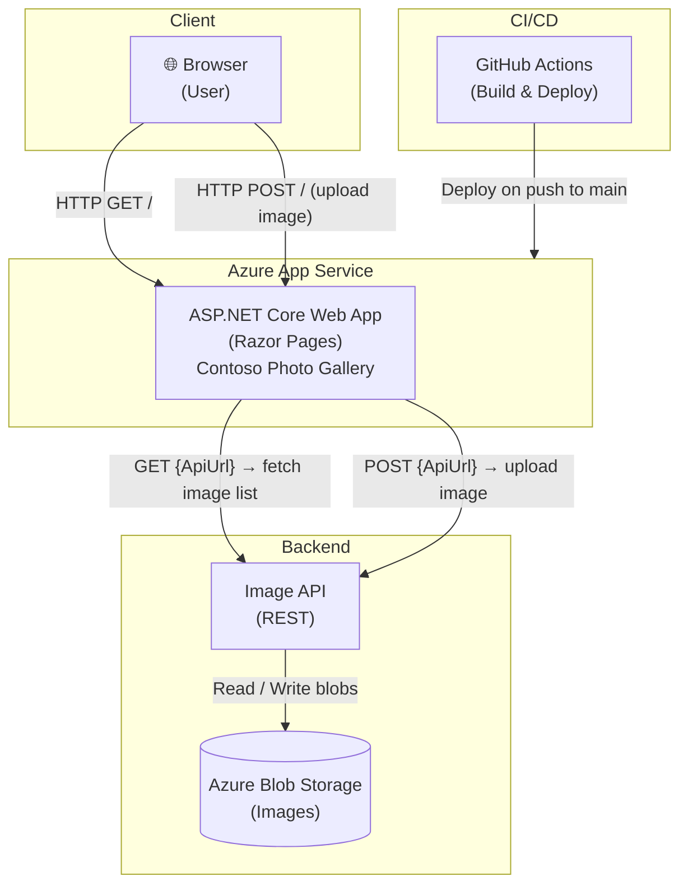

# Contoso Photo Gallery

An ASP.NET Core Razor Pages web application that allows users to upload and browse images. The web app communicates with a backend Image API, which handles storage and retrieval of images (e.g., Azure Blob Storage).

---

## Architecture Overview

The application follows a **three-tier architecture** consisting of:

1. **Client (Browser)** — The user interacts with the web UI to upload new images or browse the gallery.
2. **Web App (Azure App Service)** — An ASP.NET Core Razor Pages application that serves the UI and proxies image operations to the backend API. Configured via `appsettings.json` (`ApiUrl`).
3. **Image API** — A separate backend service responsible for storing and retrieving images (backed by Azure Blob Storage or similar).

CI/CD is handled by **GitHub Actions**, which builds and deploys the web app to Azure App Service on every push to `main`.

---

## System Architecture Diagram



---

## Components

| Component | Description |
|---|---|
| **Pages/Index.cshtml** | Razor Page that renders the image gallery and upload form |
| **Pages/Index.cshtml.cs** | Page model that calls the Image API to list and upload images |
| **Options.cs** | Configuration model holding `ApiUrl` — the backend Image API endpoint |
| **appsettings.json** | Runtime configuration file (set `ApiUrl` to the Image API base URL) |
| **Program.cs / Startup** | ASP.NET Core host and DI configuration |
| **.github/workflows** | GitHub Actions pipelines for building and deploying to Azure App Service |

---

## Getting Started

### Prerequisites

- [.NET 8 SDK](https://dotnet.microsoft.com/download)
- A running Image API endpoint

### Configuration

Set the `ApiUrl` in `appsettings.json` to point to your Image API:

```json
{
  "ApiUrl": "https://<your-image-api>.azurewebsites.net/api/images"
}
```

### Run Locally

```bash
dotnet restore
dotnet run
```

The application will be available at `https://localhost:5001` by default.

### Deploy to Azure

Pushes to the `main` branch automatically trigger the GitHub Actions workflow, which builds the app and deploys it to Azure App Service.
